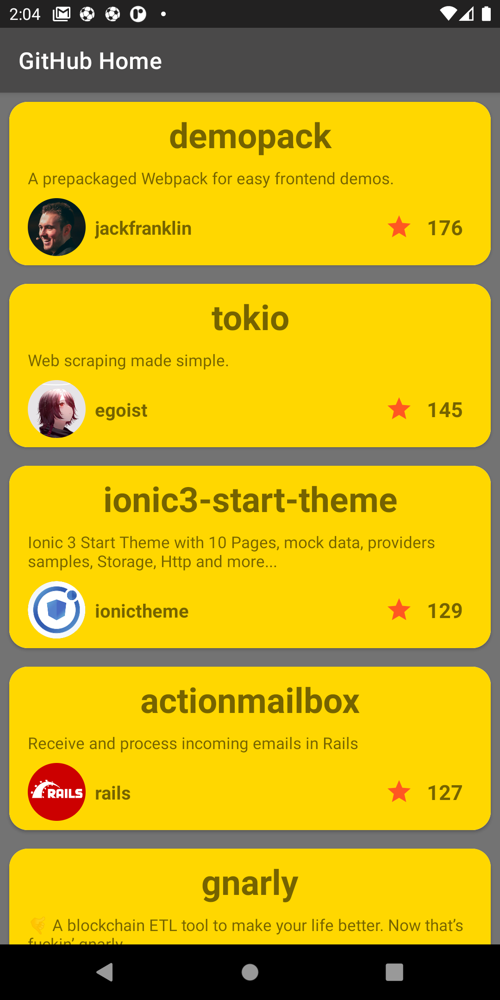

# BestRepo

a small app that will list the most starred Github repos that were created in the last 30 days.

in this app, I am using Model View ViewModel (MVVM) + Facade +Singlton + Dependency Injection  Patterns

- Repository (Facade pattern) to collect the data from many sources

- singleton to make one object instance in memory when using it
  that help to improve the memory usage 
  
- MVVM the best design architecture I prefer it that help make my code readable and more organized and we can be testing it easy 

- Dependency Injection  Using Dagger-Hilt Make my code more readable and Reduced boilerplate code and we can testing the app easily 

Other Technology
----------------
  * Kotlin
  * Coroutine
  * Pagination
  * ViewBinding
  *  CardView
  * Material Design
  * Coil

  
  

